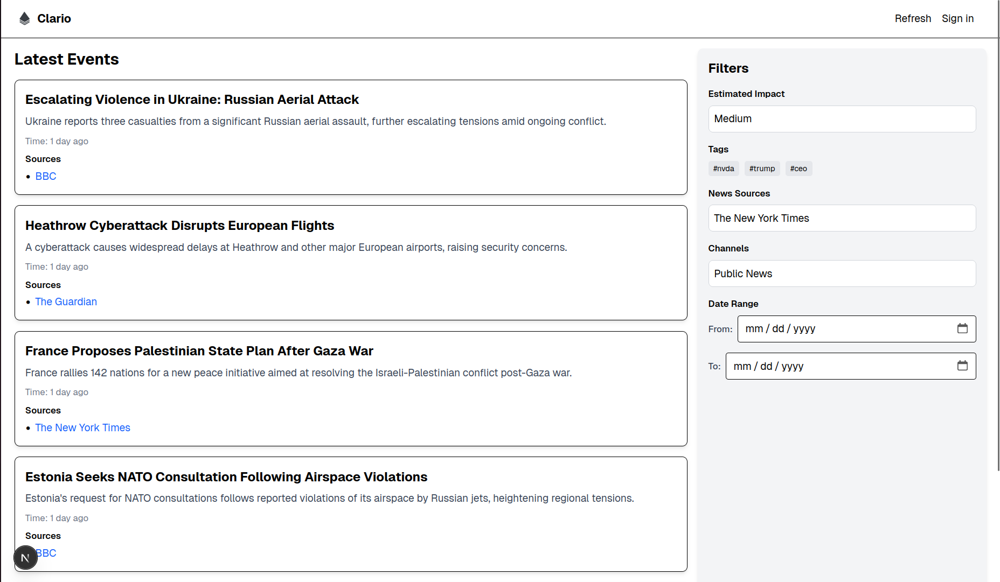

<div align="center">
  
  <h1>clario.rocks</h1>
  <p>Your one-stop solution for clear news aggregation, filtering, and analysis.</p>
</div>

---

<div align="center">   


</div>

---


DEMO

[](https://youtu.be/z0pn-rbbYcs)

## 🚀 Features

- **RSS News Aggregation**: Collect raw news data from various sources.
- **Advanced Filtering**: Identify financial relevance, significant events, and deduplicate content.
- **Market Sentiment Overview**: Visualize sentiment across equities, bonds, FX, and commodities.
- **Macro Indicator Watchlist**: Track real-time macroeconomic releases and their impacts.
- **Thematic Trend Explorer**: Detect emerging themes using AI topic clustering.
- **Risk & Volatility Dashboard**: Monitor news-driven risk signals and volatility snapshots.
- **Cross-Asset Signalboard**: Integrated signals across multiple asset classes.
- **Country & Region Heatmap**: Geographical sentiment and policy change analysis.
- **Event Impact Analyzer**: AI-scored impact of major events on forecasts.
- **Company/Sector Spotlight**: Dashboard for monitoring key companies or sectors.
- **Narrative Tracker**: Track shifts in dominant narratives and consensus forecasts.

---

## 🎨 Styling

The app follows Wellershoff branding guidelines:

- **Medium-blue / Steel-blue**: `#8796A5`
- **Very dark grey / Almost black**: `#3B3B3B`
- **Light grey / Neutral background**: `#F5F5F5` / `#EEEEEE`
- **White**: `#FFFFFF`
- **Accent / Highlight color**: `#D4C9BD`

---

## 📸 Screenshots

> Placeholder for screenshots or diagrams.

---

## 🛠️ Getting Started

### Prerequisites

- Node.js v16+
- npm v8+
- PostgreSQL

### Installation

1. Clone the repository:
   ```bash
   git clone https://github.com/tornikeo/clario.rocks.git
   ```
2. Navigate to the project directory:
   ```bash
   cd clario.rocks
   ```
3. Install dependencies:
   ```bash
   npm install
   ```
4. Set up the database:
   ```bash
   npm run db:setup
   ```
5. Start the development server:
   ```bash
   npm run dev
   ```

---

## 🤝 Contributing

We welcome contributions! Please follow these steps:

1. Fork the repository.
2. Create a new branch:
   ```bash
   git checkout -b feature/your-feature-name
   ```
3. Commit your changes:
   ```bash
   git commit -m "Add your message here"
   ```
4. Push to the branch:
   ```bash
   git push origin feature/your-feature-name
   ```
5. Open a pull request.

---

## 📜 License

This project is licensed under the MIT License. See the [LICENSE](LICENSE) file for details.

---

## 📚 Learn More

- [Next.js Documentation](https://nextjs.org/docs)
- [Prisma Documentation](https://www.prisma.io/docs)
- [Tailwind CSS Documentation](https://tailwindcss.com/docs)
- [tRPC Documentation](https://trpc.io/docs)

---

<div align="center">
  <p>Made with ❤️ by the clario.rocks team</p>
</div>
